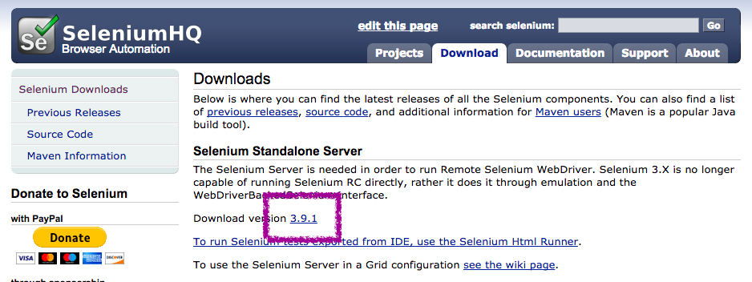
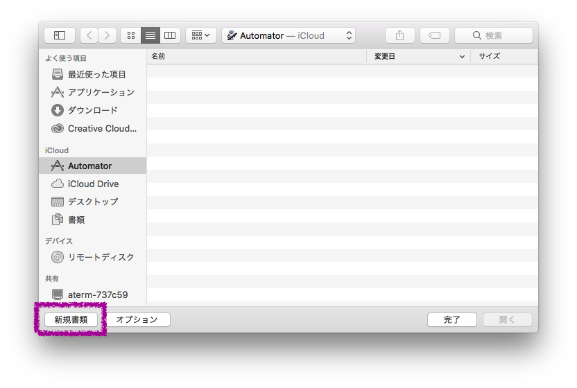
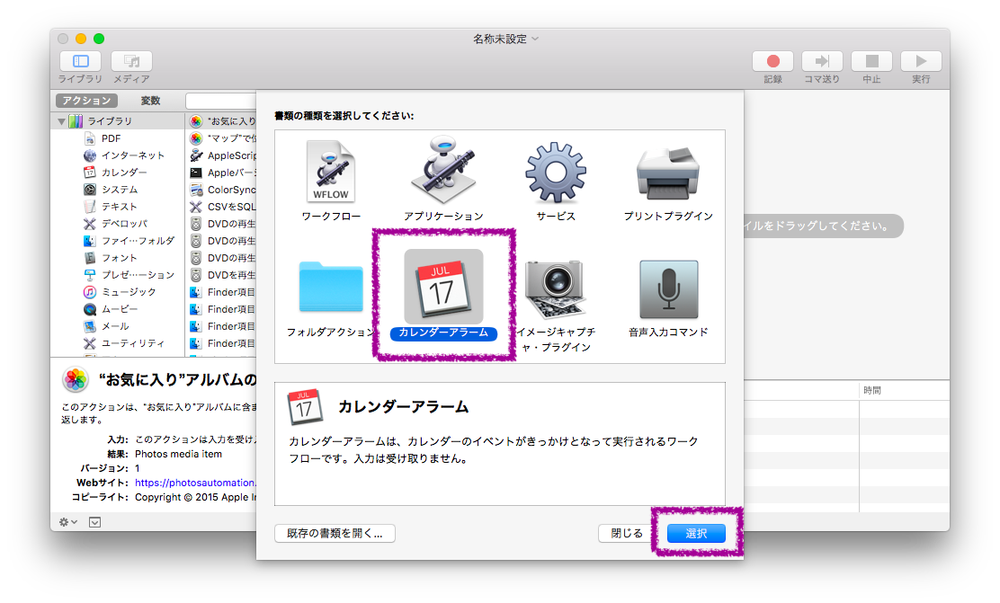
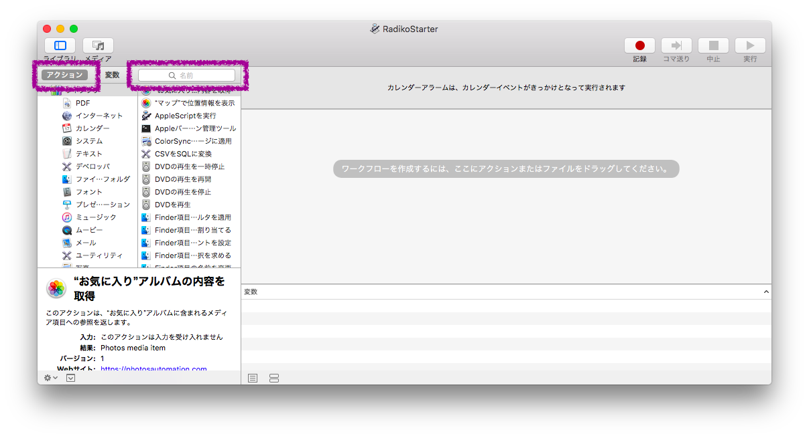
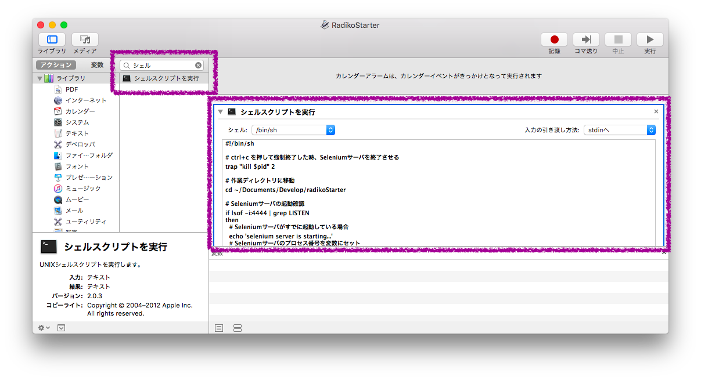
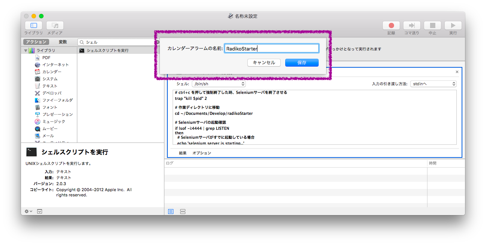
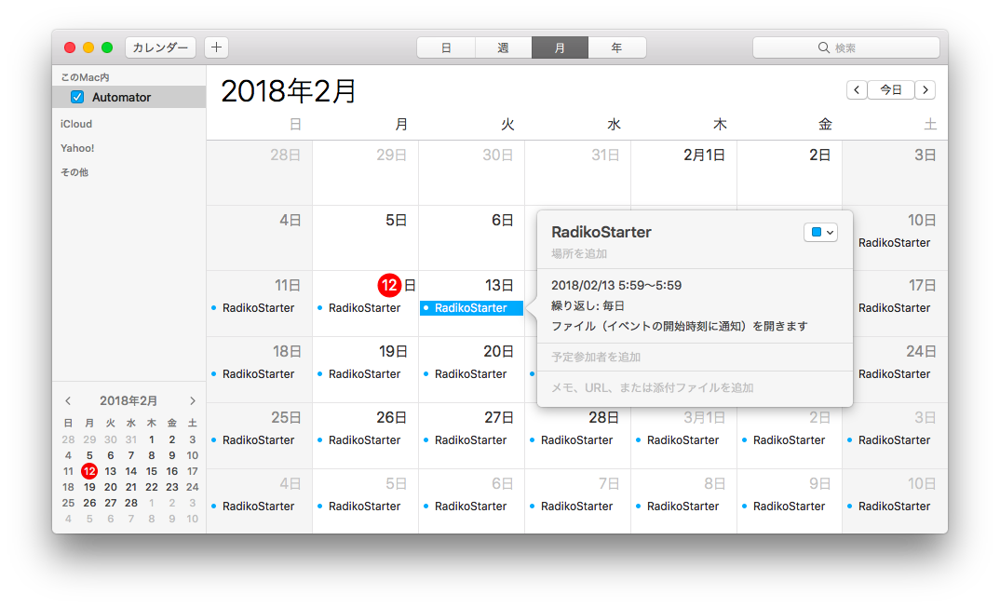

# RadikoStarter
Radikoでラジオを自動再生するプログラム

SeleniumServerとiCalを利用し、Radikoを目覚ましアラームとして機能させる

## 実行環境

- macOS　High　Sierra　10.13.3
- php 7.1.7
- Selenium Server Standalone 3.9.1
- GoogleChrome 63.0

## 利用するツール

- GoogleChrome
- Terminal
- iCal
- Automator
- facebook/webdriver 1.5

## ファイル構成

```
.
├── README.md
├── composer.json
├── composer.lock
├── kicker.php   　　　・・・　Radiko再生プログラム
├── manual
│   ├── 000.png
│   ├── 001.png
│   ├── 002.png
│   ├── 003.png
│   ├── 004.png
│   ├── 005.png
│   └── 006.png
└── radikoStarter.sh　・・・　Selenium サーバ起動プログラム 
```

## セットアップ手順

### ソース取得と初期設定

#### 1. 適当な場所で、ソースをcloneする
※　本手順では、/Users/[ユーザ名]/Documents/Develop/RadikoStarter　配下に実行ファイルを設置する

#### 2. radikoStarter.sh ７行目を編集
   ソースの設置ディレクトリのパスに変更

#### 3. kicker.php　１５行目を編集
   自動再生させたいラジオ局のURLに変更
   ※　初期状態は、MBSになっている

#### 4. kicker.php　2５行目を編集
   再生時間を変更
   ※　初期状態は、２時間経過後に再生が終了するようになっている

### ライブラリインストール

#### 1. Terminalを起動

Composer がインストールされていない方は、以下のコマンドを実行して、Composerインストール作業を初めに行うこと

```
curl -sS https://getcomposer.org/installer | php
```

#### 2. ライブラリをインストール

```
composer.phar install
```

### Selenium Server ダウンロード

以下サイトからSelenium Standalone Serverの最新版をダウンロードし、
ソースの設置ディレクトリ配下にjarファイルを配置する

http://www.seleniumhq.org/download/



### 動作確認

#### 1. Terminalで、ソースの設置ディレクトリに移動後、以下コマンドを実行する

```
sh radikoStarter.sh
```

#### 2. GoogleChromeが自動起動され、自動再生が始まることを確認する

### タイマー起動設定

#### Automator を起動し、新規書類をクリック



#### カレンダーアラームを選択



#### アクションが選択されていることを確認の上、検索ボックスに「シェル」と入力



#### 「シェルスクリプトを実行」が表示されたら、その行を右側にドラッグ

#### シェルを「/bin/sh」に変更

#### 以下のスクリプト処理を貼り付け

```
# ctrl+c を押して強制終了した時、Seleniumサーバを終了させる
trap "kill $pid" 2

# 作業ディレクトリに移動
cd ~/Documents/Develop/radikoStarter

# Seleniumサーバの起動確認
if lsof -i:4444 | grep LISTEN
then
  # Seleniumサーバがすでに起動している場合
  echo 'selenium server is starting...'
  # Seleniumサーバのプロセス番号を変数にセット
  pid=`ps -ef | grep selenium | grep -v grep | awk '{print $2}'`
  echo "process number of selenium server : ${pid}"
else
  # Seleniumサーバが起動していない場合
  echo 'selenium server is stopping...'
  # Seleniumサーバをバックエンド起動
  /usr/bin/java -jar ./selenium-server-standalone-3.9.1.jar &
  # Seleniumサーバのプロセス番号を変数にセット
  pid=%1
  echo "process number of selenium server : ${pid}"
fi

# Seleniumサーバが起動完了するまで、10秒待機
sleep 10s

# radiko再生プログラムを呼び出す
/usr/bin/php ./kicker.php

# Seleniumサーバ終了
echo "selenium server stopped"
kill $pid
```



#### command + s をクリックして、「RadikoStarter」の名称で新規登録



#### iCalを起動し、実行時間を設定する


